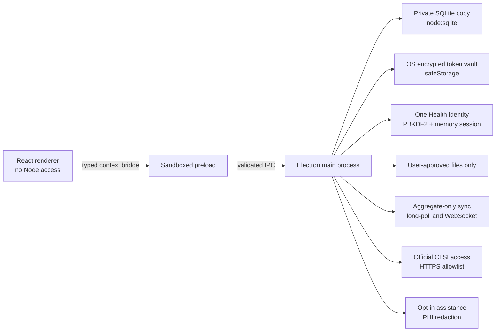

# Architecture

## Trust boundaries

The renderer cannot access Node.js, SQLite, credentials, or arbitrary filesystem paths. It calls a finite `window.amrit` API exposed by a sandboxed preload. Every IPC input is schema-validated in the main process. Database identifiers come only from a hard-coded master definition allowlist.

The main process owns database migrations, transactional writes, import/export, network access, and credential encryption. Browser windows use context isolation, no Node integration, navigation denial, new-window denial, and a restrictive content-security policy.

One Health authentication is a separate local governance boundary. The main process owns the active session and attaches the actor; renderer payloads cannot nominate an actor. Role checks protect direct-care/regulatory capture, review, corrective actions, audit access, backups, and exchange. National audit entries use the Python-compatible chained SHA-256 contract and can also verify records written by the earlier Electron hash implementation.

## Data lifecycle

1. First run resolves a private writable database path.
2. An existing Python SQLite database is copied, never opened in place.
3. Idempotent migrations add missing tables and indexes without deleting legacy data.
4. UI writes use transactions; batch imports either commit completely or roll back.
5. Records remain local. Sync query execution returns approved aggregate products only.
6. One Health UI lists are bounded for responsiveness; metrics, federation aggregates, and named standards exports use the complete selected corpus.

## Configuration model

Laboratory-independent master tables hold national/reference catalogues. Laboratory-scoped link tables provide local names, activation, sort order, panel membership, and overrides. The Master Studio exposes both through fixed definitions so new coded values do not require source edits.

Breakpoint imports are staged into a named, hashed source set. Activation is a distinct audited operation. Existing active content is not silently overwritten.
